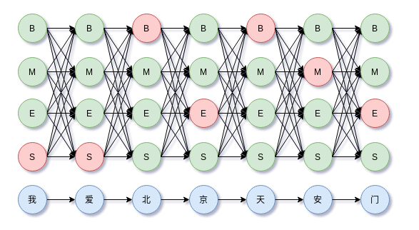

# chinese-cut-word

实现常见的分词算法，还在持续更新中...

中文分词（chinese word segment，cws）有三大难度：
- 歧义（真歧义、组合歧义、交集歧义）
- 未登录词，即新词（如地面、人名、专业术语）
- 分词规范不统一（如“上海浦东”，可以当做一个词，也可以分为“上海”和“浦东”）

中文分词大致可以分为：词典匹配和逐字标注（4tags:SBME及其扩展）两大类方法。

可参看过去的文章[中文分词详解：从词典匹配到深度学习方法](https://allenwind.github.io/blog/8269/)

## 词典匹配的分词方法

词典匹配的分词方法根据文本的扫描方向可以分为：正向和逆向；根据词的匹配策略可以分为：最长词优先和最短词优先。

具体地，常见的基于词典匹配的分词方法：

- 完全切分匹配（扫描句子，只要组成词就切分）
- 正向最长匹配
- 逆向最长匹配
- 正向最小匹配（汉语中通常是成词出现，因此较少用）
- 逆向最小匹配
- 双向最长匹配（正向最长匹配+逆向最长匹配，并使用最少切分策略即**选择词数更少**的结果）

这些方法本质上是查词典，为避免无效的扫描，提高分词速度，可以添加约束，如词的最大长度，遇到停用词跳出循环等等。

## 利用词频信息

基于词典匹配和概率统计的分词方法，在词典的基础上进一步利用词频信息：
- 基于DAG的最大概率路径组合（基于动态规划）

以上这些方法涉及词的查找、匹配和路径计算，可以配合数据结构Trie树（双数组实现效率更高）、哈希表、使用邻接表的方式存储DAG和AC自动机（Aho and Corasick）优化。其中Trie树复用词的公共前缀，节省内存。以上的基本方法可以进一步派生分词算法或策略，如期望句子切分粒度大一点，那么策略就是分词数最少。

## 逐字标注的分词方法

BMES逐字标注及其解码，

基于逐字标注的分词方法：
- HMM（viterbi decode）
- Linear+[CRF](https://github.com/allenwind/chinese-cut-word/blob/master/crf.py)
- 逐位置分类模型（softmax）
- 深度模型+CRF（CNN、RNN、BERT）

深度学习方向，这方面的内容非常丰富，可查阅相关资料，这里不详细展开。

## 构建词库（无监督分词）

词典需要通过新词发现的方案构造，新词发现与分词可以看做是互相迭代的同类算法，构建词库的方法：
- 基于信息熵的方案
- 基于语言模型的最大概率路径组合
- 通过相关矩阵阈值切分

## 对比

词典匹配和逐字标注对比：
- 基于逐字标注的方法对歧义词和未登录词的识别比单纯词典匹配的方法更好。
- 逐字标注方法对未登录词的召回比词典方法要好。
- 词典方法速度更快，适合粗分场景。

## 工程实践

现实场景：
- 中英混合
- 长文

对于长文分词，由于某些分词算法涉及内部状态记录，工程上把长文切分为block，再分词能够节省内存。中英混合文本的分词技巧，利用好中文中句和段有天然的空格或换行特点切分为互不影响的block。具体见`base.py`。继承`TokenizerBase`类，并在`find_word`实现分词的核心算法。

## 其他

以上分词算法的并行化方案可参看[count-in-parallel](https://github.com/allenwind/count-in-parallel)。

同是序列标注问题，NER可参看 https://github.com/allenwind/tensorflow-crf 。

## 参考

[1] Combining Classifiers for Chinese Word Segmentation

[2] Chinese word segmentation as character tagging

[3] neural Architectures for Named Entity Recognition

[4] https://pyahocorasick.readthedocs.io/en/latest/

[5] 《统计自然语言处理（第2版）》
